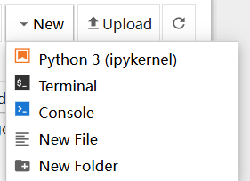
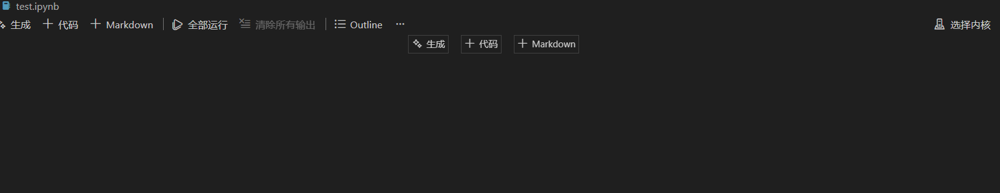
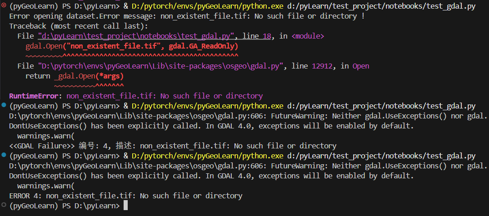

## 1. 项目文件架构

```
test_project/
├── docs/
│   ├── readme.md          # 项目说明与主要记录
│   ├── data_docs/         # 数据详细说明
│   ├── code_docs/         # 代码逻辑说明
│   └── result_docs/       # 结果分析文档
├── data/
│   ├── raster/            # 栅格数据 (如 .tif)
│   └── shapefiles/        # 矢量数据 (如 .shp)
├── notebooks/
│   ├── test_gdal.py       # 脚本测试代码
│   ├── test.ipynb         # 交互式测试代码
│   ├── error_deal/        # 错误处理模块
│   └── toolbox/           # 自定义工具箱
│       ├── raster/        # 栅格数据处理模块
│       │   ├── bands.py   # 波段合成与拆分操作
│       │   └── metadata.py # 影像元数据提取
│       └── utils.py       # 通用工具(如文件搜索)
└── result/
    └── part1/             # 结果输出目录
```

## 2. 学习过程记录：环境构建

### 2.1 创建环境
**说明**：在 Python 测绘与 GIS 领域，推荐使用 `conda-forge` 通道。
- **Defaults (默认通道)**：稳重但更新慢。
- **Conda-forge**：极客和科研人员的“社区市场”。地理信息软件更新极快，它是行业标准；且更新速度快，能更好匹配最新的卫星数据。

```bash
# 创建环境（明确指定使用 conda-forge 通道）
conda create -n pyGeoLearn -c conda-forge python=3.13
```

### 2.2 激活环境
```bash
conda activate pyGeoLearn
```

### 2.3 安装核心库
安装地理空间核心库 (`gdal`, `geopandas`) 及数据分析库。
*增加 `pyproj` (坐标转换) 和 `shapely` (几何计算)*

```bash
conda install -c conda-forge gdal geopandas pyproj shapely numpy pandas matplotlib jupyter
```

### 2.4 Jupyter 内核设置
- **Jupyter Notebook 用户**：通过 Web 界面右上角 `New` -> `Python 3` 创建。
  
- **VS Code 用户 (推荐)**：
  1. 安装 Jupyter 插件。
  2. 创建 `.ipynb` 后缀文件。
  3. 点击右上角“选择内核”并选择 `pyGeoLearn` 环境。
  

### 2.5 pytorch与GIS环境 构建（Pytorch优先）
反过来装（先 AI 后 GIS）：

你先让 PyTorch 这种“挑剔”的大型框架在干净的环境里把 CUDA 和 MKL 这种重型基础设施铺好。

此时环境的底层是“官方标准”。

接着安装 GDAL。conda-forge 的包设计得非常灵活，它发现环境中已经存在了高性能的 MKL 和运行时，它会自动降低姿态，去链接和兼容已经存在的库，而不是强行拆迁。

## 3. 学习经验总结

### 3.1 Conda 源的选择
在 GIS 领域，`conda-forge` 是首选：
1. **社区维护**：由全球开发者维护，2026 年最新的测绘算法、新型卫星数据驱动都会第一时间上线。
2. **兼容性**：在处理 Sentinel-1 或最新国产卫星数据（如 SBAS-InSAR 流程）时，老旧的 GDAL 版本可能会报错。
3. **依赖管理**：便于解决各个复杂 GIS 库之间版本不匹配导致的一系列 "Dependency Hell" 错误。

### 3.2 CPLError (GDAL 错误处理)
`CPLError` 是 GDAL 的 C++ 底层错误类在 Python 中的封装。
- **官方文档**: [GDAL CPLError API](https://gdal.org/en/stable/api/cpl.html#_CPPv48CPLError6CPLErr11CPLErrorNumPKcz)
- **调试技巧**: 使用 `gdal.UseExceptions()` 可以让 GDAL 抛出标准的 Python 异常，而不是仅仅在控制台打印错误信息。

**异常捕获的三种方法**:
1. `try...except` 结构（推荐结合 `UseExceptions`）。
2. 自定义错误处理器（利用 `CPLError` 编写 `catch_error.gdal_error_handler`）。
3. 默认的 `CPLError` 处理（仅控制台输出）。



### 3.3 GDAL Dataset 数据对象
- **核心概念**: 学习如何将栅格文件读取为 `Dataset` 对象，并读取相关元数据（GeoTransform, Projection 等）。
- **实践**: 构建 `get_data_info` 函数，实现数据信息的格式化输出与字典返回，便于后续调用。

### 3.4 波段数据读取 (Band Read)
学习如何读取波段数据并转为 NumPy 数组进行计算。
- **底层流程**: `GetRasterBand` -> `ReadRaster` (返回字节串) -> `struct.unpack` (解包) -> 转 NumPy -> `reshape` -> 显示。
- **推荐方法**: 调用 `ReadAsArray()`。
  - 流程简化为: `GetRasterBand` -> `ReadAsArray()` (直接返回数组) -> `reshape` -> 显示。

### 3.5 资源对象管理
GDAL 底层基于 C++，需要显式管理内存资源。
- **释放资源**: 操作结束后，必须执行 `dataset = None` (对应 C++ 的 `GDALClose`)。
- **风险**: 不及时释放会导致数据写入不完整或文件被占用无法再次打开。
- **最佳实践**: 推荐使用上下文管理器 `with ... as ...` 自动管理资源（需 GDAL Python bindings 支持），或确保代码最后显式置空。

### 3.6 拷贝数据文件
使用 `CreateCopy` 方法可以快速基于现有文件创建副本。

```python
# 1. 获取驱动
driver = gdal.GetDriverByName('GTiff')

# 2. 拷贝文件 (src_ds 为已打开的源数据集对象)
# strict=0: 允许在无法完全匹配源数据结构时近似处理，不报错
# options: 设置瓦片存储和压缩方式
dst_ds = driver.CreateCopy(
    dst_filename, 
    src_ds, 
    strict=0,
    options=["TILED=YES", "COMPRESS=PACKBITS"]
)
```

### 3.7 创建新文件 (Create)
从头创建 GTiff 文件的核心步骤：

```python
# 1. 创建文件
driver = gdal.GetDriverByName('GTiff')
dst_ds = driver.Create(dst_filename, x_size, y_size, band_count, gdal.GDT_Float32)

# 2. 写入地理参考
dst_ds.SetGeoTransform(geotransform_list)  # 写入仿射变换参数

srs = osr.SpatialReference()
srs.ImportFromEPSG(4326) # 示例：设置 WGS84 坐标系
dst_ds.SetProjection(srs.ExportToWkt())   # 写入投影信息

# 3. 写入数据
dst_ds.GetRasterBand(1).WriteArray(numpy_array)

# 4. 释放资源 (重要)
dst_ds = None 
```

### 3.8 多波段数据读取
使用rasterio对多波段数据进行读取的时候，可以通过for in zip 进行读取